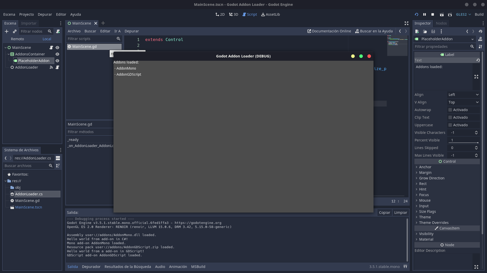

# Simple Add-on API Loader for Godot 3.5

 

This repo is an example of how to implement a add-ons loader in Godot. There is 2 main proyects and 2 add-ons proyects, which contains:

- **GodotGDScript**: A version of a small Godot 3.5 game. It contains the `AddonsLoader.gd` script that loads all `.pck` and `.zip` addons. The add-ons must be installed in `user://addons`.
- **GodotMono**: A version of a small Godot 3.5 Mono game. This proyect is very interesting for me because it contains the `AddonsLoader.cs`. This class can loads `.pck` and `.zip` Godot packages that contains GDScript add-ons (like the *GodotGDScript* proyect), and also `.dll` libraries than use Godot Mono runtime, allowing loading of add-ons programmed in both languages. It uses the same folder like **GodotGDScipt**.
- **AddonGDScript**: A example of a GDScript add-on that prints a hello world message on load. You can compress this folder as `.zip` file and installs it in `user://addons`.
- **AddonMono**: A example of a Mono add-on that prints a hello world message on load. It is a .NET 6 library proyect, and you can run `dotnet build` over the folder to compilate the `.dll` file and install it in the add-ons folder used in the main proyects.

